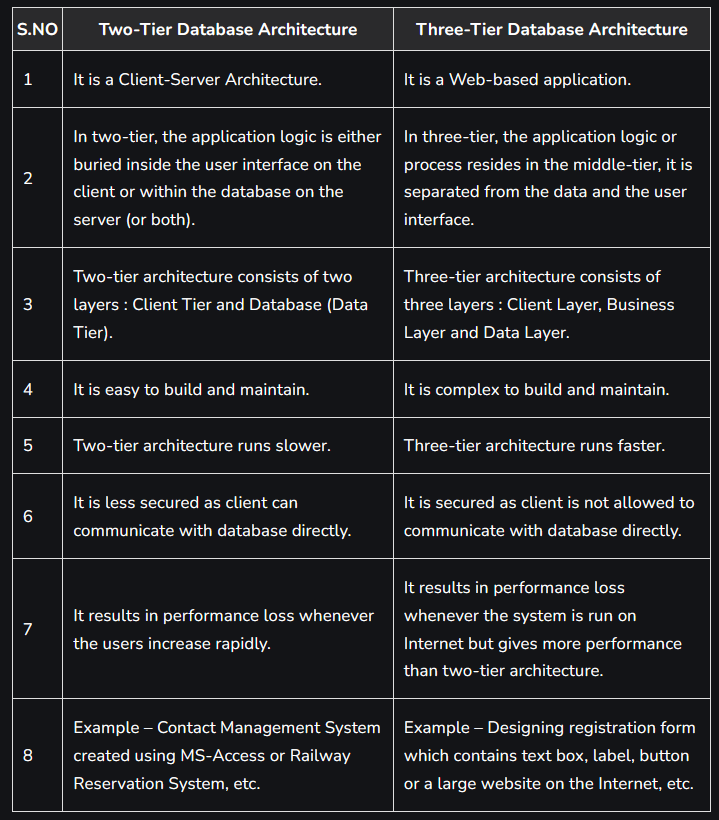

> Explain the difference between two-tier and three-tier application architectures.
> Which is better suited for web applications? Why?

1. Two Tier : In 2-tier, the application logic is either buried inside the User Interface on the client r within the database on the server (or both). With 2-tier client/server architecture, the user system interface is usually located in the user's desktop environment and the database management services are usually in a server that is a more powerful machine that serves the client.
2. Three Tier : in 3-tier, the application logic or process lives in the middle-tier, it is separated from the data and the user interface. These are more scalable, robust and flexible. In addition, they can integrate data from multiple sources. In this, a middle tier is added between the user system interface client environment and the database management server environment. These can be implemented in a variety of ways, such as transaction processing monitors, message servers, or application servers.

In modern world, we are now using 4-tier architecture. If we take most chatting mobile application they are a three-tier architecture with a local database such as sqlite for caching the data and accessing it when the mobile is not connected to the internet.
