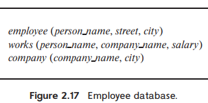

> Consider the employee database of Figure 2.17. What are the appropriate primary-keys?
>
> 

The appropriate primary keys are shown below:

employee(***person_name** *, street, city)
works(***person_name***, company_name, salary)
company(***company_name***, city)
