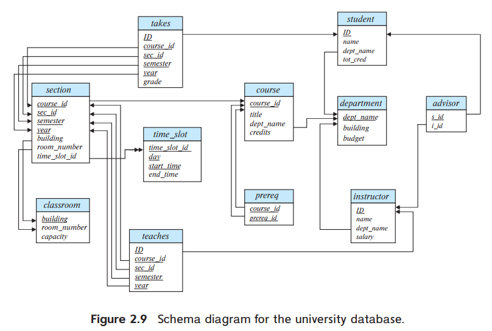

> Consider the _advisor_ relation shown in the schema diagram in Figure 2.9, with _s_id_ as the primary key of _advisor_. Suppose a student can have more than one advisor. Then, would _s_id_ still be a primary key of the _advisor_ relation? If not, what should the primary key of _advisor_ be?
>
> 

---

*s_id* alone cannot be a primary key to the *advisor* relation, since there may be two or more tuples for a single student, corresponding to two or more advisors i.e. it doesn't identify uniquely a tuple in the relation advisor. Eg. It is possible for one student to have many advisors.

Primary key of *advisor* can be *s_id*, *i_id*.
