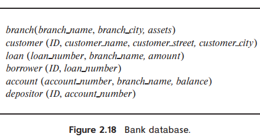

> Consider the bank database of Figure 2.18. Give an expression in the relational algebra for each of the following queries:
>
> a. Find each loan number with a loan amount greater than $10000.
> b. Find the ID of each depositor who has an account with a balance greater than $6000.
> c. Find the ID of each depositor who has an account with a balance greater than $6000 at the "Uptown" branch.
>
> 

---

a. $\Pi_{loan\_number}(\sigma_{amount > 10000}(loan))$

b. $\Pi_{ID}(depositor \bowtie_{depositor.account\_number = account.account\_number} (\sigma_{balance > 6000}(account)))$

c. $\Pi_{ID}(depositor \bowtie_{depositor.account\_number = account.account\_number} (\sigma_{balance > 6000 \wedge branch\_name = "Uptown"}(account) ))$
