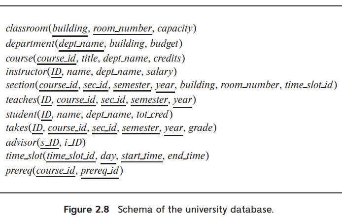
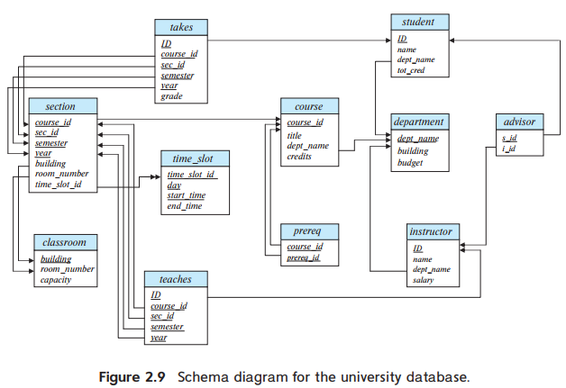

> Write the following queries in relational algebra, using the university schema.
>
> a. Find the ID and name of each instructor in the Physics department.
> b. Find the ID and name of each instructor in a department located in the building "Watson".
> c. Find the ID and name of each student who has taken at least one course in the "Comp. Sci." department.
> d. Find the ID and name of each student who has taken at least one course section in the year 2018.
> e. Find the ID and name of each student who has not taken any course section in the year 2018.
>
> 
>
> 

---

a. $\Pi_{ID, name}(\sigma_{dept\_name = "Physics"}(instructor))$

b. $\Pi_{ID, name}(instructor \bowtie_{instructor.dept\_name = department.dept\_name} (\sigma_{building = "Watson"}(department)))$

c. $\Pi_{student.ID, student.name}(\sigma_{dept\_name = "Comp. Sci"}(student \bowtie_{student.ID = takes.ID} takes \bowtie_{takes.course\_id = course.course\_id} course))$

d. $\Pi_{student.ID, student.name}(\sigma_{year = 2018}(student \bowtie_{student.ID = takes.ID} takes)$

e. $\Pi_{ID, name}(student) - \Pi_{student.ID, student.name}(\sigma_{year = 2018}(student \bowtie_{student.ID = takes.ID} takes)$
