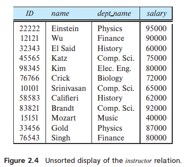
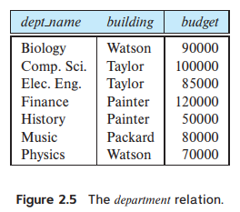

> Consider the foreign-key constraint from the _dept_name_ attribute of _instructor_ to the _department_ relation. Give examples of inserts and deletes to these relations that can cause a violation of the foreign-key constraint.
>
> 
>
> 

* Insert a tuple
  (10111, Ostrom, Economics, 110000)
  into the _instructor_ table, where the _department_ table does not have the department _Economics_, would violate the foreign-key constraint.
* Delete the tuple
  (Biology, Watson, 90000)
  from the _department_ table, where at least one _student_ or _instructor_ tuple has _dept_name_ as Biology, would violate the foreign-key constraint.
