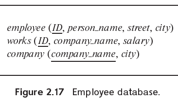

> Consider the employee database of Figure 2.17. Give an expression in the relational algebra to express each of the following queries:
>
>
> a. Find the name of each employee who lives in city "Miami".
>
>
> b. Find the name of each employee whose salary is greater than $100000.
>
>
> c. Find the name of each employee who lives in "Miami" and whose salary is
> greater than $100000.
>
> 

a. $\Pi_{person\_name}(\sigma_{city = "Miami"}(employee))$

b. $\Pi_{person\_name}(\sigma_{salary > 100000}(employee \bowtie works))$

c.$\Pi_{person\_name}(\sigma_{salary > 100000 \wedge city = "Miami"}(employee \bowtie works))$
