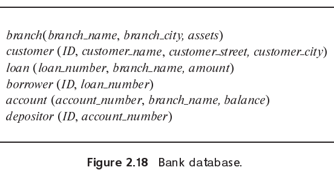

> Consider the bank database of Figure 2.18. Give an expression in the relational algebra for each of the following queries:
>
> a. Find the name of each branch located in "Chicago".
>
> b. Find the ID of each borrower who has a loan in branch "Downtown".
>
> 

a.$\Pi_{branch\_name}(\sigma_{branch\_city = "Chicago"}(branch))$

b.$\Pi_{ID}(\sigma_{branch\_name = "Downtown"}(loan \bowtie_{loan.loan\_number = borrower.loan\_number} borrower))$
