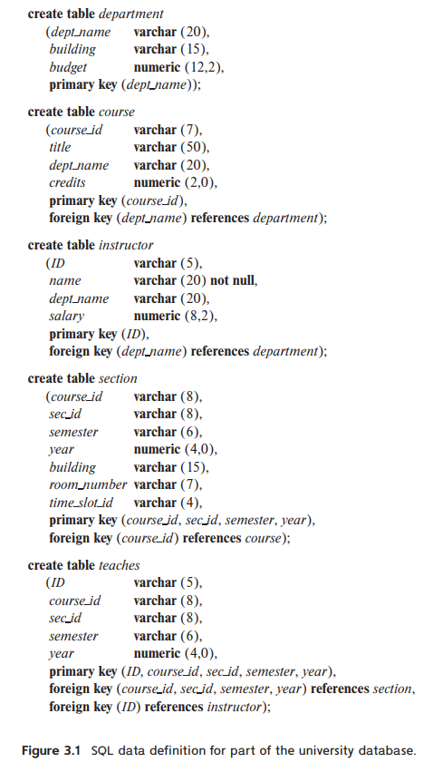

> Write the following queries in SQL, using the university schema.
>
> a. Find the titles of courses in the Comp. Sci. department that have 3 credits.
> b. Find the IDs of all students who were taught by an instructor named Einstein; make sure there are no duplicates in the result.
> c. Find the highest salary of any instructor.
> d. Find all instructors earning the highest salary (there may be more than one with the same salary).
> e. Find the enrollment of each section that was offered in Fall 2017.
> f. Find the maxium enrollment, across all sections, in Fall 2017.
> g. Find the sections that had the maximum enrollment in Fall 2017.
>
> 

---

a. Find the titles of courses in the Comp. Sci. department that have 3 credits.

```sql
SELECT title 
FROM course
WHERE dept_name = 'Comp. Sci.' AND credits = 3;
```

b. Find the IDs of all students who were taught by an instructor named Einstein; make sure there are no duplicates in the result.
This query can be answered in several different ways. One way is as follows.

```sql
SELECT DISTINCT takes.ID
FROM takes, instructor, teaches
WHERE takes.course_id = teaches.course_id AND 
    takes.sec_id = teaches.sec_id AND 
    takes.semester = teaches.semester AND 
    takes.year = teaches.year AND 
    teaches.id = instructor.id AND 
    instructor.name = 'Einstein'
```

Another method by using subqueries

```sql
SELECT DISTINCT id 
FROM takes
WHERE (course_id, sec_id, semester, year) IN 
(
    SELECT course_id, sec_id, semester, year 
    FROM teaches INNER JOIN instructor 
        ON teaches.id = instructor.id
    WHERE instructor.name = 'Einstein'
);
```

c. Find the highest salary of any instructor.

```sql
SELECT MAX(salary) 
FROM instructor
```

d. Find all instructors earning the highest salary (there may be more than one with the same salary).

```sql
SELECT id, name
FROM instructor
WHERE salary = (SELECT MAX(salary) FROM instructor)
```

e. Find the enrollment of each section that was offered in Fall 2017.

```sql
SELECT course_id, sec_id, (
    SELECT COUNT(id)
    FROM takes
    WHERE takes.year = section.year
        AND takes.semester = section.semester
        AND takes.course_id = section.course_id 
        AND takes.sec_id = section.sec_id
) AS enrollment 
FROM section 
WHERE semester = 'Fall' AND year = 2017
```

Note that if the result of the subquery is empty, the aggregate function **count** returns a value of 0. One way of writing the query might appear to be:

```sql
SELECT course_id, sec_id, COUNT(id)
FROM takes
WHERE semester = 'Fall' AND year = 2017
GROUP BY course_id, sec_id
```

But note that if a section does not have any students taking it, it would not appear in the result. One way of ensuring such a section appears with a count of 0 is to use the **outer join** operation, covered in Chapter 4.

f. Find the maxium enrollment, across all sections, in Fall 2017. One way of writing this query is as follows:

```sql
WITH enrollment_in_fall_2017(course_id, sec_id, enrollment) AS (
    SELECT course_id, sec_id, COUNT(id)
    FROM takes
    WHERE semester = 'Fall' AND year = 2017
    GROUP BY course_id, sec_id
) 
SELECT CASE 
        WHEN MAX(enrollment) IS NOT NULL THEN MAX(enrollment)
        ELSE 0
       END
FROM enrollment_in_fall_2017;
```

g. Find the sections that had the maximum enrollment in Fall 2017.

```sql
WITH enrollment_in_fall_2017(course_id, sec_id, enrollment) AS (
    SELECT course_id, sec_id, COUNT(id) 
    FROM takes
    WHERE semester = 'Fall' AND year = 2017
    GROUP BY course_id, sec_id
) 
SELECT course_id, sec_id
FROM enrollment_in_fall_2017
WHERE enrollment = (SELECT MAX(enrollment) FROM enrollment_in_fall_2017);
```

It is also possible to write the query without the **with** clause, but the subquery to find enrollment would get repeated twice in the query. While not incorrect to add **distinct** in the **count**, it is not necessary in light of the primary key constraint on _takes_.
