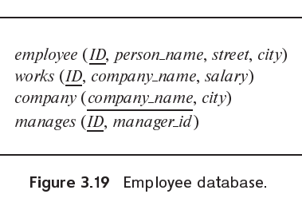

> Consider the relational database of Figure 3.19. Give an expression in SQL for each of the following:
>
> a. Modify the database so that the employee whose ID is '12345' now lives in "Newtown".
> b. Give each manager of "First Bank Corporation" a 10 percent raise unless the salary becomes greater than $100000; in such cases, give only a 3 percent raise.
>
> 

---

a. Modify the database so that the employee whose ID is '12345' now lives in "Newtown".

```sql
UPDATE employee
SET city = 'Newtown'
WHERE ID = '12345' 
```

b. Give each manager of "First Bank Corporation" a 10 percent raise unless the salary becomes greater than $100000; in such cases, give only a 3 percent raise.

```sql
UPDATE works T
SET T.salary = T.salary * 1.03
WHERE T.ID IN (SELECT manager_id FROM manages)
    AND T.salary * 1.1 > 100000
    AND T.company_name = 'First Bank Corporation';

UPDATE works T
SET T.salary = T.salary * 1.1
WHERE T.ID IN (SELECT manager_id FROM manages)
    AND T.salary * 1.1 <= 100000
    AND T.company_name = 'First Bank Corporation';
```

The above updates would give different results if executed in the opposite order. We give below a safer solution using the **case** statement.

```sql
UPDATE works T
SET T.salary = T.salary * ( 
    CASE
        WHEN (T.salary * 1.1 > 100000) THEN 1.03
        ELSE 1.1 
    END
)
WHERE T.ID IN (SELECT manager_id FROM manages) 
    AND T.company_name = 'First Bank Corporation'
```
