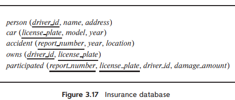

> Consider the insurance database of Figure 3.17, where the primary keys are underlined. Construct the following SQL queries for this relational database.
>
> a. Find the number of accidents involving a car belonging to a person named "John Smith".
> b. Update the damage amount for the car with license_plate "AABB2000" in the accident with report number "AR2197" to $3000.
>
> 

---

a. Find the number of accidents involving a car belonging to a person named "John Smith".

```sql
WITH all_cars_owned_by_john_smith(license_plate) AS (
    SELECT license_plate 
    FROM person INNER JOIN owns ON person.driver_id = owns.driver_id
    WHERE person.name = 'John Smith'
)
SELECT COUNT(DISTINCT report_number)
FROM participated 
WHERE license_plate IN (SELECT license_plate FROM all_cars_owned_by_john_smith);
```

b. Update the damage amount for the car with license_plate "AABB2000" in the accident with report number "AR2197" to $3000.

```sql
UPDATE participated 
SET damage_amount = 3000
WHERE report_number = 'AR2197' AND license_plate = 'AABB2000';
```
