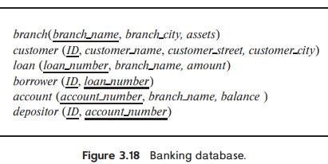

> Consider the bank database of Figure 3.18, where the primary keys are underlined. Construct the following SQL queries for this relational database.
>
> a. Find each customer who has an account at _every_ branch located in "Brooklyn".
> b. Find the total sum of all loan amounts in the bank.
> c. Find the names of all branches that have assets greater than those of at least one branch located in "Brooklyn".
>
> 

---

a. Find each customer who has an account at _every_ branch located in "Brooklyn".

```sql
WITH all_branches_in_brooklyn(branch_name) AS (
    SELECT branch_name 
    FROM branch
    WHERE branch_city = 'Brooklyn'
)
SELECT ID, customer_name 
FROM customer AS c1
WHERE NOT EXISTS (
    (SELECT branch_name FROM all_branches_in_brooklyn)
    EXCEPT
    (
        SELECT branch_name
        FROM account INNER JOIN depositor 
            ON account.account_number = depositor.account_number
        WHERE depositor.ID = c1.ID
    )
)
```

b. Find the total sum of all loan amounts in the bank.

```sql
SELECT SUM(amount)
FROM loan
```

c. Find the names of all branches that have assets greater than those of at least one branch located in "Brooklyn".

```sql
SELECT branch_name
FROM branch
WHERE assets > SOME (
    SELECT assets
    FROM branch
    WHERE branch_city = 'Brooklyn'
);
```
