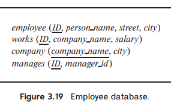

> Consider the employee database of Figure 3.19. Give an expression in SQL for each of the following queries.
>
> a. Give all employees for "First Bank Corporation" a 10 percent raise.
> b. Give all managers of "First Bank Corporation" a 10 percent raise.
> c. Delete all tuples in the _works_ relation for employees of "Small Bank Corporation".
>
> 

---

a. Give all employees for "First Bank Corporation" a 10 percent raise.

```sql
UPDATE works 
SET salary = salary * 1.1
WHERE company_name = 'First Bank Corporation'
```

b. Give all managers of "First Bank Corporation" a 10 percent raise.

```sql
UPDATE works
SET salary = salary * 1.1
WHERE company_name = 'First Bank Corporation' AND id IN (
    SELECT manager_id
    FROM manages
)
```

c. Delete all tuples in the _works_ relation for employees of "Small Bank Corporation".

```sql
DELETE FROM works
WHERE company_name = 'Small Bank Corporation'
```
