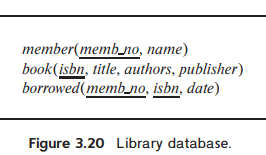

> Consider the library database of Figure 3.20. Write the following queries in SQL.
>
> a. Find the member number and name of each member who has borrowed at least one book published by "McGraw-Hill".
> b. Find the member number and name of each member who has borrowed every book published by "McGraw-Hill".
> c. For each publisher, find the member number and name of each member who has borrowed more than five books of that publisher.
> d. Find the average number of books borrowed per member. Take into account that if a member does not borrow any books, then that member does not appear in the _borrowed_ relation at all, but that member still counts in the average.
>
> 

---

a. Find the member number and name of each member who has borrowed at least one book published by "McGraw-Hill".

```sql
SELECT memb_no, name
FROM member AS m
WHERE EXISTS (
    SELECT * 
    FROM book INNER JOIN borrowed ON book.isbn = borrowed.isbn 
    WHERE book.publisher = 'McGraw-Hill' AND 
            borrowed.memb_no = m.memb_no
)
```

b. Find the member number and name of each member who has borrowed every book published by "McGraw-Hill".

```sql
SELECT memb_no, name
FROM member AS m 
WHERE NOT EXISTS (
    (
        SELECT isbn
        FROM book
        WHERE publisher = 'McGraw-Hill'
    )
    EXCEPT 
    (
        SELECT isbn
        FROM borrowed
        WHERE memb_no = m.memb_no
    )
) 
```

c. For each publisher, find the member number and name of each member who has borrowed more than five books of that publisher.

```sql
WITH member_borrowed_book(memb_no, memb_name,isbn,title,authors,publisher,date) AS (
    SELECT member.memb_no, name, book.isbn, title, authors, publisher, date
    FROM member INNER JOIN borrowed ON member.memb_no = borrowed.memb_no
                INNER JOIN book ON borrowed.isbn = book.isbn
)
SELECT memb_no, memb_name, publisher, COUNT(isbn)
FROM member_borrowed_book
GROUP BY memb_no, memb_name, publisher
HAVING COUNT(isbn) > 5;
```

d. Find the average number of books borrowed per member. Take into account that if a member does not borrow any books, then that member does not appear in the _borrowed_ relation at all, but that member still counts in the average.

```sql
WITH number_of_books_borrowed(memb_no, memb_name, number_of_books) AS (
    SELECT memb_no, name, (
        CASE
            WHEN NOT EXISTS (SELECT * FROM borrowed WHERE borrowed.memb_no = member.memb_no) THEN 0
            ELSE (SELECT COUNT(*) FROM borrowed WHERE borrowed.memb_no = member.memb_no) 
        END
    )
    FROM member
)
SELECT AVG(number_of_books) AS average_number_of_books_borrowed_per_member
FROM number_of_books_borrowed
```
